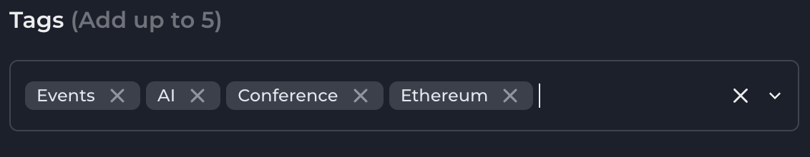
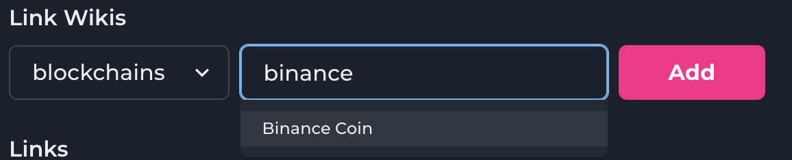
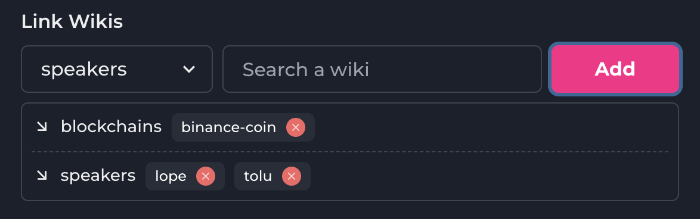
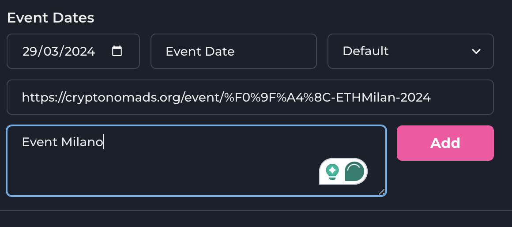

## Events User Flow Documentation

1. Login using metamask extension
2. Click the **_create wiki_** button in the navbar
3. Enter the event title
4. Select or Drag an image to the **_Main Image_** widget
5. Add Image or Video media that will be embedded in the event wiki details
6. Embed the image to the text Editor
7. Write out the event details just like you are creating a wiki with citations.
8. Generate summary for the event wiki
9. Click the **_Edit Wiki Details_** button
10. Select a category for the event
11. Add the necessary tags for the event wiki including an **_Event Tag_**. The Tags should include an **_interest_** that covers the event wiki and an **_event type_** for the wiki.

12. Select the link wikis dropdown to pick the Blockchain that the event represents e.g Polygon, Ethereum, Solana, e.t.c.

 13. Select the link wikis dropdown to pick a speaker for the event by typing out the speaker wiki if it is available. 14. Select the link dropdown for the wiki details widget 15. Fill the event dates form
 16. Close widget, then publish event.
